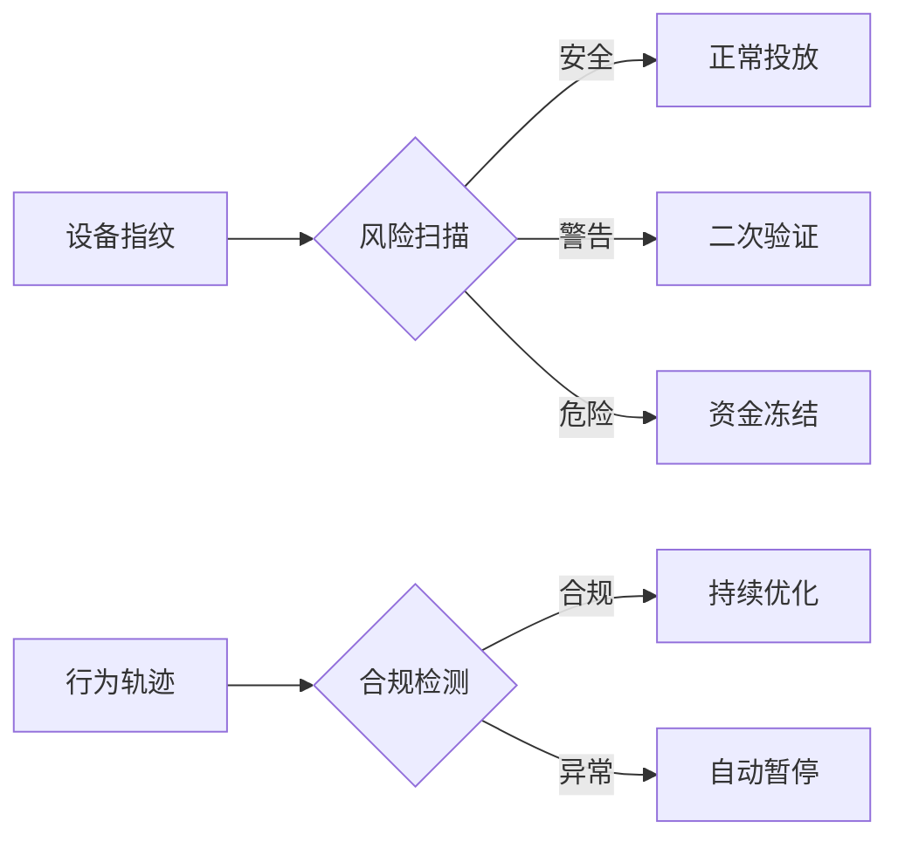

```markdown
# Facebook广告账户实战手册：从创建到运营的科学法则

---

## 一、账户选择的进化论策略
### 1.1 成长阶段的精准匹配模型
- **探索期（月预算<$3000）**
采用"3+1"组合：3个个人账户承担创意测试，1个备企业账户负责核心转化。
个人户每日投放严格控制在$200-$220区间，预留10%安全缓冲避免超支[^1]。

- **扩张期（月预算$3000-$15000）**
配置"企业主站+个人卫星站"架构：
主账户承担600-800美元日消耗，利用平台返点政策[^1]
2个预升级个人账户分别负责新受众挖掘与竞品流量拦截

- **成熟期（月预算>$15000）**
构建账户矩阵集群：
营业执照裂变7个企业账户[^6]，每账户对应独立产品线
创建域名联盟池，每个主域名关联3个分流域名[^2]

---

## 二、开户准备的工业级预处理
### 2.1 企业资质预查验系统

1. **双通道核验机制**
使用国家企业信用信息公示系统API接口实时验证营业执照有效性[^2]
平行比对工商数据库与Facebook主体信息匹配度

2. **智能文档工场**
- 公司中英文名称生成器（含常见错误规避模板）
- 域名备案快速通道（自动生成隐私政策文件）
- 主页内容生成器（输出合规的2-3条预发布内容）

### 2.2 数字资产预加载仓库
| 资产类型       | 存储规格          | 更新机制       |
|----------------|-------------------|----------------|
| 主体证明文件   | 云端加密存储      | 月度复核       |
| 备用支付方式   | 3家银行虚拟卡池   | 动态轮换       |
| 多语言素材库   | 500+组跨文化设计  | AI实时优化     |
| 法律文书模版   | 全语种合规包      | 季度升级       |

---

## 三、账户创建的效率革命
### 3.1 企业账户快速通道
```flow
st=>start: 开始创建
op1=>operation: 访问Business Manager
op2=>operation: 创建BM平台账号
op3=>operation: 申请广告账户
cond1=>condition: 材料完整?
op4=>operation: 代理审核提交
op5=>operation: Policy审核
e=>end: 账户开通

st->op1->op2->op3->cond1
cond1(yes)->op4->op5->e
cond1(no)->op3
```

### 3.2 账户设置黄金参数
- **支付安全组合**：Visa卡(40%)+MasterCard(40%)+预付卡(20%)
- **限额预警系统**：当日消耗达90%预算时触发三级提醒机制
- **动态权限管理**：分设操作员（素材上传）、策略师（预算设置）、审计员（数据监控）

---

## 四、预算调控的新数学模型
### 4.1 智能预算分配引擎
```
日预算 = 基准值 × (1 + 0.2×CTR波动系数) × (1 - 0.15×成本偏差率)
周预算 = Σ日预算 × (1 + 0.05×转化增长趋势)
```

### 4.2 机器学习保护机制

- **第1阶段（0-20小时）**：锁定5组核心受众，禁止任何参数调整
- **第2阶段（20-50小时）**：允许每小时更换10%素材元素
- **第3阶段（50+小时）**：开启自动扩量模式，预算波动幅度≤35%

---

## 五、风险控制的量子护盾
### 5.1 多维防御矩阵


### 5.2 应急响应体系
- **账户克隆技术**：每日零点自动生成全量镜像包
- **流量无损迁移**：主域名故障时15分钟内完成备域名切换[^2]
- **数据安全舱**：实时加密存储投放数据与用户互动记录

---

## 六、未来进化路线图
### 6.1 企业账户管理API系统
- 跨平台数据接口标准化
- 智能合约自动化财务管理

### 6.2 增强现实操作界面
- 3D可视化广告数据宇宙
- 手势交互式预算调控系统

### 6.3 区块链存证体系
- 不可篡改的投放记录链
- 智能合约自动结算系统
```
